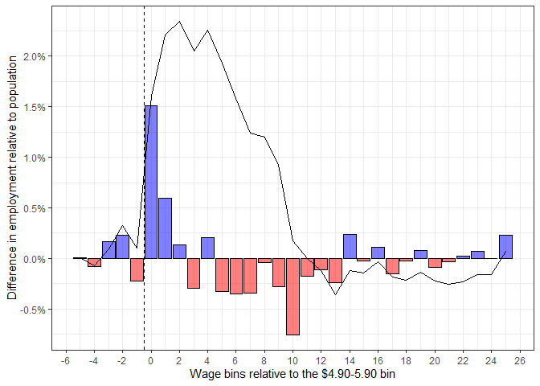

R Markdown for ‘Effects of Minimum Wages’
================
true
19 1 2022

-   [1 Read and Prepare Data](#read-and-prepare-data)
-   [2 Pre and Post: Comparison](#pre-and-post-comparison)
    -   [2.1 Treatment Group](#treatment-group)
    -   [2.2 Control Group](#control-group)
-   [3 Pre and Post: Differences](#pre-and-post-differences)
    -   [3.1 Treatment Group](#treatment-group-1)
    -   [3.2 Control Group](#control-group-1)
-   [4 Actual vs. Counter-factual](#actual-vs-counter-factual)
    -   [4.1 Counter-factual](#counter-factual)
    -   [4.2 Actual vs. Counter-factual:
        Comparison](#actual-vs-counter-factual-comparison)
    -   [4.3 Actual vs. Counter-factual: Difference
        (DiD)](#actual-vs-counter-factual-difference-did)
    -   [4.4 sum(DiD) and Elasticity of
        Employment](#sumdid-and-elasticity-of-employment)
-   [5 Employment-to-Population Rates](#employment-to-population-rates)
    -   [5.1 Comparison: Total ER](#comparison-total-er)
    -   [5.2 Comparison: Margins](#comparison-margins)

``` r
# Packages:
library(haven) # Read_dta {haven}
library(tidyverse) # ggplot, dplyr et al.
library(scales) # scales-package {scales}
library(psych) # Describe {psych}
library(arules) # Discretize {arules}
```

sessionInfo {utils}: Collect Information About the Current R Session

``` r
sessioninfo::session_info()
```

    ## - Session info ---------------------------------------------------------------
    ##  setting  value
    ##  version  R version 4.1.2 (2021-11-01)
    ##  os       Windows 10 x64 (build 19042)
    ##  system   x86_64, mingw32
    ##  ui       RTerm
    ##  language (EN)
    ##  collate  German_Switzerland.1252
    ##  ctype    German_Switzerland.1252
    ##  tz       Europe/Berlin
    ##  date     2022-01-19
    ##  pandoc   2.14.0.3 @ C:/Program Files/RStudio/bin/pandoc/ (via rmarkdown)
    ## 
    ## - Packages -------------------------------------------------------------------
    ##  package     * version date (UTC) lib source
    ##  arules      * 1.7-3   2022-01-09 [1] CRAN (R 4.1.2)
    ##  assertthat    0.2.1   2019-03-21 [2] CRAN (R 4.1.1)
    ##  backports     1.3.0   2021-10-27 [2] CRAN (R 4.1.1)
    ##  broom         0.7.10  2021-10-31 [2] CRAN (R 4.1.1)
    ##  cellranger    1.1.0   2016-07-27 [2] CRAN (R 4.1.1)
    ##  cli           3.1.0   2021-10-27 [2] CRAN (R 4.1.1)
    ##  colorspace    2.0-2   2021-06-24 [2] CRAN (R 4.1.1)
    ##  crayon        1.4.2   2021-10-29 [2] CRAN (R 4.1.1)
    ##  DBI           1.1.1   2021-01-15 [2] CRAN (R 4.1.1)
    ##  dbplyr        2.1.1   2021-04-06 [2] CRAN (R 4.1.1)
    ##  digest        0.6.28  2021-09-23 [2] CRAN (R 4.1.1)
    ##  dplyr       * 1.0.7   2021-06-18 [2] CRAN (R 4.1.1)
    ##  ellipsis      0.3.2   2021-04-29 [2] CRAN (R 4.1.1)
    ##  evaluate      0.14    2019-05-28 [2] CRAN (R 4.1.1)
    ##  fansi         0.5.0   2021-05-25 [2] CRAN (R 4.1.1)
    ##  fastmap       1.1.0   2021-01-25 [2] CRAN (R 4.1.1)
    ##  forcats     * 0.5.1   2021-01-27 [2] CRAN (R 4.1.1)
    ##  fs            1.5.0   2020-07-31 [2] CRAN (R 4.1.1)
    ##  generics      0.1.1   2021-10-25 [2] CRAN (R 4.1.1)
    ##  ggplot2     * 3.3.5   2021-06-25 [2] CRAN (R 4.1.1)
    ##  glue          1.4.2   2020-08-27 [2] CRAN (R 4.1.1)
    ##  gtable        0.3.0   2019-03-25 [2] CRAN (R 4.1.1)
    ##  haven       * 2.4.3   2021-08-04 [2] CRAN (R 4.1.1)
    ##  hms           1.1.1   2021-09-26 [2] CRAN (R 4.1.1)
    ##  htmltools     0.5.2   2021-08-25 [2] CRAN (R 4.1.1)
    ##  httr          1.4.2   2020-07-20 [2] CRAN (R 4.1.1)
    ##  jsonlite      1.7.2   2020-12-09 [2] CRAN (R 4.1.1)
    ##  knitr         1.36    2021-09-29 [2] CRAN (R 4.1.1)
    ##  lattice       0.20-45 2021-09-22 [2] CRAN (R 4.1.1)
    ##  lifecycle     1.0.1   2021-09-24 [2] CRAN (R 4.1.1)
    ##  lubridate     1.8.0   2021-10-07 [2] CRAN (R 4.1.1)
    ##  magrittr      2.0.1   2020-11-17 [2] CRAN (R 4.1.1)
    ##  Matrix      * 1.3-4   2021-06-01 [2] CRAN (R 4.1.1)
    ##  mnormt        2.0.2   2020-09-01 [1] CRAN (R 4.1.1)
    ##  modelr        0.1.8   2020-05-19 [2] CRAN (R 4.1.1)
    ##  munsell       0.5.0   2018-06-12 [2] CRAN (R 4.1.1)
    ##  nlme          3.1-153 2021-09-07 [2] CRAN (R 4.1.1)
    ##  pillar        1.6.4   2021-10-18 [2] CRAN (R 4.1.1)
    ##  pkgconfig     2.0.3   2019-09-22 [2] CRAN (R 4.1.1)
    ##  psych       * 2.1.9   2021-09-22 [1] CRAN (R 4.1.2)
    ##  purrr       * 0.3.4   2020-04-17 [2] CRAN (R 4.1.1)
    ##  R6            2.5.1   2021-08-19 [2] CRAN (R 4.1.1)
    ##  Rcpp          1.0.7   2021-07-07 [2] CRAN (R 4.1.1)
    ##  readr       * 2.0.2   2021-09-27 [2] CRAN (R 4.1.1)
    ##  readxl        1.3.1   2019-03-13 [2] CRAN (R 4.1.1)
    ##  reprex        2.0.1   2021-08-05 [2] CRAN (R 4.1.1)
    ##  rlang         0.4.12  2021-10-18 [2] CRAN (R 4.1.1)
    ##  rmarkdown     2.11    2021-09-14 [2] CRAN (R 4.1.1)
    ##  rstudioapi    0.13    2020-11-12 [2] CRAN (R 4.1.1)
    ##  rvest         1.0.2   2021-10-16 [2] CRAN (R 4.1.1)
    ##  scales      * 1.1.1   2020-05-11 [2] CRAN (R 4.1.1)
    ##  sessioninfo   1.2.2   2021-12-06 [1] CRAN (R 4.1.2)
    ##  stringi       1.7.5   2021-10-04 [2] CRAN (R 4.1.1)
    ##  stringr     * 1.4.0   2019-02-10 [2] CRAN (R 4.1.1)
    ##  tibble      * 3.1.5   2021-09-30 [2] CRAN (R 4.1.1)
    ##  tidyr       * 1.1.4   2021-09-27 [2] CRAN (R 4.1.1)
    ##  tidyselect    1.1.1   2021-04-30 [2] CRAN (R 4.1.1)
    ##  tidyverse   * 1.3.1   2021-04-15 [2] CRAN (R 4.1.1)
    ##  tmvnsim       1.0-2   2016-12-15 [1] CRAN (R 4.1.1)
    ##  tzdb          0.2.0   2021-10-27 [2] CRAN (R 4.1.1)
    ##  utf8          1.2.2   2021-07-24 [2] CRAN (R 4.1.1)
    ##  vctrs         0.3.8   2021-04-29 [2] CRAN (R 4.1.1)
    ##  withr         2.4.2   2021-04-18 [2] CRAN (R 4.1.1)
    ##  xfun          0.27    2021-10-18 [2] CRAN (R 4.1.1)
    ##  xml2          1.3.2   2020-04-23 [2] CRAN (R 4.1.1)
    ##  yaml          2.2.1   2020-02-01 [2] CRAN (R 4.1.1)
    ## 
    ##  [1] \\unetna01/MarxerB$/Daten/R/win-library/4.1
    ##  [2] C:/Program Files/R/library
    ## 
    ## ------------------------------------------------------------------------------

# 1 Read and Prepare Data

``` r
# It is recommended that you download the files by hand (faster)
# Otherwise, run this code chunk:
morg91 <- read_dta("https://data.nber.org/morg/annual/morg91.dta")
morg92 <- read_dta("https://data.nber.org/morg/annual/morg92.dta")
morg93 <- read_dta("https://data.nber.org/morg/annual/morg93.dta")
morg94 <- read_dta("https://data.nber.org/morg/annual/morg94.dta")
morg95 <- read_dta("https://data.nber.org/morg/annual/morg95.dta")
morg96 <- read_dta("https://data.nber.org/morg/annual/morg96.dta")
```

``` r
# Read and merge .dta files ---
# Read the files (if you saved them by hand)
morg91 <- read_dta("morg91.dta")
morg92 <- read_dta("morg92.dta")
morg93 <- read_dta("morg93.dta")
morg94 <- read_dta("morg94.dta")
morg95 <- read_dta("morg95.dta")
morg96 <- read_dta("morg96.dta")

# Merge the data sets to a single data set
morg <- bind_rows(morg91, morg92)
morg <- bind_rows(morg, morg93)
morg <- bind_rows(morg, morg94)
morg <- bind_rows(morg, morg95)
morg <- bind_rows(morg, morg96)

# Remove old files from the environment:
rm(morg91)
rm(morg92)
rm(morg93)
rm(morg94)
rm(morg95)
rm(morg96)
gc()
```

``` r
# States in Treatment / Control / Excluded ---
# List with states and groups:
Control_Group <- structure(list(
  Name = c(
    "Alabama", "Alaska", "Arizona", "Arkansas",
    "California", "Colorado", "Connecticut", "Delaware", "Florida",
    "Georgia", "Hawaii", "Idaho", "Illinois", "Indiana", "Iowa",
    "Kansas", "Kentucky", "Louisiana", "Maine", "Maryland", "Massachusetts",
    "Michigan", "Minnesota", "Mississippi", "Missouri", "Montana",
    "Nebraska", "Nevada", "New Hampshire", "New Jersey", "New Mexico",
    "New York", "North Carolina", "North Dakota", "Ohio", "Oklahoma",
    "Oregon", "Pennsylvania", "Rhode Island", "South Carolina", "South Dakota",
    "Tennessee", "Texas", "Utah", "Vermont", "Virginia", "Washington",
    "West Virginia", "Wisconsin", "Wyoming", "Washington D.C:"
  ),
  `Postal Code` = c(
    "AL", "AK", "AZ", "AR", "CA", "CO", "CT",
    "DE", "FL", "GA", "HI", "ID", "IL", "IN", "IA", "KS", "KY",
    "LA", "ME", "MD", "MA", "MI", "MN", "MS", "MO", "MT", "NE",
    "NV", "NH", "NJ", "NM", "NY", "NC", "ND", "OH", "OK", "OR",
    "PA", "RI", "SC", "SD", "TN", "TX", "UT", "VT", "VA", "WA",
    "WV", "WI", "WY", "DC"
  ), FIPS = c(
    1, 2, 4, 5, 6, 8, 9, 10,
    12, 13, 15, 16, 17, 18, 19, 20, 21, 22, 23, 24, 25, 26, 27,
    28, 29, 30, 31, 32, 33, 34, 35, 36, 37, 38, 39, 40, 41, 42,
    44, 45, 46, 47, 48, 49, 50, 51, 53, 54, 55, 56, 11
  ), Group = c(
    "YES",
    "NO", "YES", "YES", "YES", "YES", "NO", "NO", "YES", "YES",
    "NO", "YES", "YES", "YES", "NO", "YES", "YES", "YES", "YES",
    "YES", "NO", "YES", "YES", "YES", "YES", "YES", "YES", "YES",
    "YES", "NO", "YES", "YES", "YES", "YES", "YES", "YES", "NO",
    "YES", "NO", "YES", "YES", "YES", "YES", "YES", "NO", "YES",
    "Treatment", "YES", "YES", "YES", "NO"
  )
), class = c(
  "tbl_df",
  "tbl", "data.frame"
), row.names = c(NA, -51L))

# Filter out excluded states and districts
morg <- morg %>%
  filter(!stfips %in% Control_Group$FIPS[Control_Group$Group == "NO"])

# Treatment Group Dummy
morg$treatment <- as.numeric(morg$stfips == 53) 
```

``` r
# Restrict to age 16-68, as common in the literature (e.g. Card 1995) (<16 is excluded anyways)
morg <- morg %>% filter(age >= 16 & age <= 68)
```

``` r
# Create common hourly wage variable ---
psych::describe(morg$earnhre) # cents per hour, edited
```

    ##    vars      n   mean     sd median trimmed    mad min  max range skew kurtosis
    ## X1    1 514228 929.49 548.55    800  849.65 407.71  10 9999  9989 3.36    28.89
    ##      se
    ## X1 0.76

``` r
psych::describe(morg$uhourse) # usual weekly hours, edited
```

    ##    vars      n  mean    sd median trimmed mad min max range  skew kurtosis   se
    ## X1    1 894453 36.98 14.09     40   36.98   0  -4  99   103 -0.87     2.59 0.01

``` r
psych::describe(morg$earnwke) # usual weekly earning, dollars per hour, edited
```

    ##    vars      n   mean  sd median trimmed    mad min  max range skew kurtosis
    ## X1    1 835000 466.85 340    388  419.49 274.28   0 1923  1923 1.63      3.5
    ##      se
    ## X1 0.37

``` r
# convert hourly earnings from cents/h to usd/h
morg$earnhre <- morg$earnhre / 100
morg$earnhr <- morg$earnhr / 100
```

``` r
# define common hourly wage variable
morg$wage <- ifelse(!is.na(morg$earnhre), morg$earnhre,
  ifelse(!is.na(morg$earnwke), morg$earnwke / morg$uhourse,
    ifelse(!is.na(morg$earnhr), morg$earnhr,
      ifelse(!is.na(morg$uearnwk), morg$uearnwk / morg$uhours, NA)
    )
  )
)

psych::describe(morg$wage) # What stands out: Inf Values, Negative Values.
```

    ##    vars      n mean  sd median trimmed  mad     min max range skew kurtosis  se
    ## X1    1 837694  Inf NaN   9.35   10.19 5.41 -480.75 Inf   Inf  NaN      NaN NaN

``` r
# remove negative values (set them as NA)
morg$wage[morg$wage < 0] <- NA # Wage<0 is not possible. Comes from negative weekly hours

# take care of Inf values, and aggregate >30 for later on
morg$wage[morg$wage > 30] <- 30.1 # Group wages higher than 30 dollars per hour into this largest bin (also the Inf ones)

psych::describe(morg$wage) # What stands out: No more Inf and negatives.
```

    ##    vars      n  mean   sd median trimmed  mad min  max range skew kurtosis   se
    ## X1    1 828321 11.19 6.52    9.5   10.28 5.44   0 30.1  30.1 1.17     0.89 0.01

``` r
# Discretize hourly wages:
morg$bins <- discretize(morg$wage,
  method = "fixed",
  breaks = c(
    0, 0.9, 1.9, 2.9, 3.9, 4.9, 5.9, 6.9, 7.9, 8.9, 9.9,
    10.9, 11.9, 12.9, 13.9, 14.9, 15.9, 16.9, 17.9, 18.9, 19.9,
    20.9, 21.9, 22.9, 23.9, 24.9, 25.9, 26.9, 27.9, 28.9, 29.9, 30.9
  )
)

morg$bins2 <- as.character(morg$bins)
morg$bins2[morg$bins == "[0,0.9)"] <- "-5"
morg$bins2[morg$bins == "[0.9,1.9)"] <- "-4"
morg$bins2[morg$bins == "[1.9,2.9)"] <- "-3"
morg$bins2[morg$bins == "[2.9,3.9)"] <- "-2"
morg$bins2[morg$bins == "[3.9,4.9)"] <- "-1"
morg$bins2[morg$bins == "[4.9,5.9)"] <- "0"
morg$bins2[morg$bins == "[5.9,6.9)"] <- "1"
morg$bins2[morg$bins == "[6.9,7.9)"] <- "2"
morg$bins2[morg$bins == "[7.9,8.9)"] <- "3"
morg$bins2[morg$bins == "[8.9,9.9)"] <- "4"
morg$bins2[morg$bins == "[9.9,10.9)"] <- "5"
morg$bins2[morg$bins == "[10.9,11.9)"] <- "6"
morg$bins2[morg$bins == "[11.9,12.9)"] <- "7"
morg$bins2[morg$bins == "[12.9,13.9)"] <- "8"
morg$bins2[morg$bins == "[13.9,14.9)"] <- "9"
morg$bins2[morg$bins == "[14.9,15.9)"] <- "10"
morg$bins2[morg$bins == "[15.9,16.9)"] <- "11"
morg$bins2[morg$bins == "[16.9,17.9)"] <- "12"
morg$bins2[morg$bins == "[17.9,18.9)"] <- "13"
morg$bins2[morg$bins == "[18.9,19.9)"] <- "14"
morg$bins2[morg$bins == "[19.9,20.9)"] <- "15"
morg$bins2[morg$bins == "[20.9,21.9)"] <- "16"
morg$bins2[morg$bins == "[21.9,22.9)"] <- "17"
morg$bins2[morg$bins == "[22.9,23.9)"] <- "18"
morg$bins2[morg$bins == "[23.9,24.9)"] <- "19"
morg$bins2[morg$bins == "[24.9,25.9)"] <- "20"
morg$bins2[morg$bins == "[25.9,26.9)"] <- "21"
morg$bins2[morg$bins == "[26.9,27.9)"] <- "22"
morg$bins2[morg$bins == "[27.9,28.9)"] <- "23"
morg$bins2[morg$bins == "[28.9,29.9)"] <- "24"
morg$bins2[morg$bins == "[29.9,30.9]"] <- "25" # Wage bin with the wages 30 and above. Needs two brackets, no braces
morg$bins2[is.na(morg$bins2)] <- "26" # Will label this bin as NA later in the analysis.
morg$bins2 <- as.numeric(morg$bins2)
```

# 2 Pre and Post: Comparison

$$ \\beta = \\underbrace{e^{k}\_{1,1} - e^{k}\_{1,0}}\_{\\text{Change in treatment}} - \\underbrace{(e^{k}\_{0,1} - e^{k}\_{0,0})}\_{\\text{Change in control}} $$

## 2.1 Treatment Group

``` r
wpre <- subset(x = morg, subset = morg$year < 1994 & morg$treatment == 1)
wpost <- subset(x = morg, subset = morg$year > 1993 & morg$treatment == 1)

wpre <- wpre %>%
  group_by(year, bins2) %>%
  dplyr::summarize(w = sum(weight, na.rm = T)) %>%
  mutate(freq = w / sum(w)) %>%
  group_by(bins2) %>%
  summarise(freq = mean(freq)) %>%
  mutate(group = 0) %>%
  mutate(bins2 = na_if(bins2, 26))

wpost <- wpost %>%
  group_by(year, bins2) %>%
  dplyr::summarize(w = sum(weight, na.rm = T)) %>%
  mutate(freq = w / sum(w)) %>%
  group_by(bins2) %>%
  summarise(freq = mean(freq)) %>%
  mutate(group = 1) %>%
  mutate(bins2 = na_if(bins2, 26))

ww <- bind_rows(wpre, wpost)

ggplot(data = ww, aes(x = bins2, y = freq, fill = factor(group))) +
  geom_bar(stat = "identity", position = "identity", alpha = 0.2, color = "black", size = 0.25) +
  theme_bw() +
  theme(legend.justification = "top", legend.position = c(0.85, 0.95)) +
  scale_y_continuous(labels = scales::label_percent(accuracy = 1), limits = c(0, 0.065), breaks = scales::pretty_breaks(n = 6)) +
  geom_vline(xintercept = -0.5, linetype = "dashed") +
  scale_x_continuous(breaks = scales::pretty_breaks(n = 14)) +
  scale_fill_manual(
    labels = c("Pre-Treatment", "Post-Treatment"),
    values = c("orange", "blue")
  ) +
  guides(fill = guide_legend(title = "Time Period")) +
  ylab("Relative frequency conditional on total employment") +
  xlab("Wage bins relative to the $4.90-5.90 bin")
```

<!-- -->

## 2.2 Control Group

``` r
### Compare Pre- and Post- Wage Distribution in the Comparison Areas, by Wage Bins, IN LONG FORMAT.
cpre <- subset(x = morg, subset = morg$year < 1994 & morg$treatment == 0)
cpost <- subset(x = morg, subset = morg$year > 1993 & morg$treatment == 0)

cpre <- cpre %>%
  group_by(year, bins2) %>%
  summarise(w = sum(weight, na.rm = T)) %>%
  mutate(freq = w / sum(w)) %>%
  group_by(bins2) %>%
  summarise(freq = mean(freq)) %>%
  mutate(group = 0) %>%
  mutate(bins2 = na_if(bins2, 26))

cpost <- cpost %>%
  group_by(year, bins2) %>%
  summarise(w = sum(weight, na.rm = T)) %>%
  mutate(freq = w / sum(w)) %>%
  group_by(bins2) %>%
  summarise(freq = mean(freq)) %>%
  mutate(group = 1) %>%
  mutate(bins2 = na_if(bins2, 26))

cc <- bind_rows(cpre, cpost)

ggplot(data = cc, aes(x = bins2, y = freq, fill = factor(group))) +
  geom_bar(stat = "identity", position = "identity", alpha = 0.2, color = "black", size = 0.25) +
  theme_bw() +
  theme(legend.justification = "top", legend.position = c(0.85, 0.95)) +
  scale_y_continuous(labels = scales::label_percent(accuracy = 1), limits = c(0, 0.065), breaks = scales::pretty_breaks(n = 6)) +
  geom_vline(xintercept = -0.5, linetype = "dashed") +
  scale_x_continuous(breaks = scales::pretty_breaks(n = 14)) +
  scale_fill_manual(
    labels = c("Pre-Treatment", "Post-Treatment"),
    values = c("orange", "blue")
  ) +
  guides(fill = guide_legend(title = "Time Period")) +
  ylab("Relative frequency conditional on total employment") +
  xlab("Wage bins relative to the $4.90-5.90 bin")
```

<!-- -->

# 3 Pre and Post: Differences

## 3.1 Treatment Group

``` r
### Difference for WW:
wq1 <- ww %>%
  filter(group == 1) %>% # Post Treatment
  drop_na()
wq0 <- ww %>%
  filter(group == 0) %>% # Pre Treatment
  drop_na()

wq <- bind_cols(wq1, wq0) %>%
  select(1, 2, 5) %>%
  rename("post" = "freq...2", "pre" = "freq...5", "bins2" = 1) %>%
  mutate(diff = post - pre) %>%
  mutate(pos = diff >= 0)

ggplot(data = wq) +
  geom_bar(aes(x = bins2, y = diff, fill = pos), stat = "identity", color = "black", size = 0.25, alpha = 0.5) +
  scale_fill_manual(values = c("Red", "Blue"), guide = "none") +
  theme_bw() +
  geom_line(aes(x = bins2, y = cumsum(diff))) +
  geom_vline(xintercept = -0.5, linetype = "dashed") +
  scale_x_continuous(breaks = scales::pretty_breaks(n = 14)) +
  scale_y_continuous(
    labels = scales::label_percent(accuracy = 0.1),
    breaks = scales::pretty_breaks(n = 8),
    limits = c(-0.03, 0.0125)
  ) +
  ylab("Pre- and Post-Treatment Difference") +
  xlab("Wage bins relative to the $4.90-5.90 bin")
```

<!-- -->

## 3.2 Control Group

``` r
### Difference for CC:
cq1 <- cc %>%
  filter(group == 1) %>% # Post Treatment
  drop_na()
cq0 <- cc %>%
  filter(group == 0) %>% # Pre Treatment
  drop_na()

cq <- bind_cols(cq1, cq0) %>%
  select(1, 2, 5) %>%
  rename("post" = "freq...2", "pre" = "freq...5", "bins2" = 1) %>%
  mutate(diff = post - pre) %>%
  mutate(pos = diff >= 0)

ggplot(data = cq) +
  geom_bar(aes(x = bins2, y = diff, fill = pos), stat = "identity", color = "black", size = 0.25, alpha = 0.5) +
  scale_fill_manual(values = c("Red", "Blue"), guide = "none") +
  theme_bw() +
  geom_line(aes(x = bins2, y = cumsum(diff))) +
  geom_vline(xintercept = -0.5, linetype = "dashed") +
  scale_x_continuous(breaks = scales::pretty_breaks(n = 14)) +
  scale_y_continuous(
    labels = scales::label_percent(accuracy = 0.1),
    breaks = scales::pretty_breaks(n = 8),
    limits = c(-0.03, 0.0125)
  ) +
  ylab("Pre- and Post-Treatment Difference") +
  xlab("Wage bins relative to the $4.90-5.90 bin")
```

<!-- -->

# 4 Actual vs. Counter-factual

## 4.1 Counter-factual

*e*<sub>*C**F*, 1</sub><sup>*k*</sup> = *e*<sub>1, 0</sub><sup>*k*</sup> + (*e*<sub>0, 1</sub><sup>*k*</sup>−*e*<sub>0, 0</sub><sup>*k*</sup>)

``` r
# Actual vs. Counterfactual -----------------------------------------------
### Counterfactual: WA-Pre with the Difference of the Comparison Areas
counter <- wpre %>%
  drop_na()
counter <- bind_cols(counter, cq) %>%
  select(1:2, 7) %>%
  rename("bins2" = 1, "wapre" = 2, "control" = 3) %>%
  mutate(diff = wapre + control) %>%
  mutate(pos = diff >= 0)

ggplot(data = counter, aes(x = bins2, y = diff)) +
  geom_bar(stat = "identity", position = "identity", alpha = 0.2) +
  theme_bw() +
  scale_y_continuous(labels = scales::label_percent(accuracy = 1), limits = c(-0.01, 0.065), breaks = scales::pretty_breaks(n = 6)) +
  geom_vline(xintercept = -0.5, linetype = "dashed") +
  scale_x_continuous(breaks = scales::pretty_breaks(n = 14)) +
  ylab("Relative frequency conditional on total employment") +
  xlab("Wage bins relative to the $4.90-5.90 bin")
```

<!-- -->

## 4.2 Actual vs. Counter-factual: Comparison

``` r
### Actual (Post-WA "wpost") vs. Counterfactual (Pre-WA + Difference in Control Group "counter") -------------
wc <- counter %>%
  select(1, 4) %>%
  mutate(group = 0) %>%
  rename("freq" = 2)
wcounter <- bind_rows(wc, wpost)

ggplot(data = wcounter, aes(x = bins2, y = freq, fill = factor(group))) +
  geom_bar(stat = "identity", position = "identity", alpha = 0.2, color = "black", size = 0.25) +
  theme_bw() +
  theme(legend.justification = "top", legend.position = c(0.8, 0.95)) +
  scale_y_continuous(labels = scales::label_percent(accuracy = 1), limits = c(0, 0.065), breaks = scales::pretty_breaks(n = 6)) +
  geom_vline(xintercept = -0.5, linetype = "dashed") +
  scale_x_continuous(breaks = scales::pretty_breaks(n = 14)) +
  scale_fill_manual(
    labels = c("Counter-factual", "Actual"),
    values = c("orange", "blue")
  ) +
  guides(fill = guide_legend(title = "Post-Treatment Group")) +
  ylab("Relative frequency conditional on total employment") +
  xlab("Wage bins relative to the $4.90-5.90 bin")
```

<!-- -->

## 4.3 Actual vs. Counter-factual: Difference (DiD)

*β* = *e*<sub>1, 1</sub><sup>*k*</sup> − *e*<sub>*C**F*, 1</sub><sup>*k*</sup>

``` r
# Difference-in-Difference: Comparison of Actual vs. Counterfactual (Counterfactual = PreWA - (Post-Pre in Control) )
wd1 <- wcounter %>%
  filter(group == 1) %>% # Actual "wpost"
  drop_na()
wd0 <- wcounter %>%
  filter(group == 0) %>% # Counter "counter"
  drop_na()

wd <- bind_cols(wd1, wd0) %>%
  select(1, 2, 5) %>%
  rename("post" = "freq...2", "pre" = "freq...5", "bins2" = 1) %>%
  mutate(diff = post - pre) %>%
  mutate(pos = diff >= 0)

ggplot(data = wd) +
  geom_bar(aes(x = bins2, y = diff, fill = pos), stat = "identity", color = "black", size = 0.25, alpha = 0.5) +
  scale_fill_manual(values = c("Red", "Blue"), guide = "none") +
  theme_bw() +
  geom_line(aes(x = bins2, y = cumsum(diff))) +
  geom_vline(xintercept = -0.5, linetype = "dashed") +
  scale_x_continuous(breaks = scales::pretty_breaks(n = 14)) +
  scale_y_continuous(labels = scales::label_percent(accuracy = 0.1), breaks = scales::pretty_breaks(n = 6)) +
  ylab("Difference in employment relative to population") +
  xlab("Wage bins relative to the $4.90-5.90 bin")
```

<!-- -->

## 4.4 sum(DiD) and Elasticity of Employment

``` r
# DiD:
sum(wd$diff) # [1] 0.0007098001
```

    ## [1] 0.0007098001

``` r
# Elasticity of Employment with respect to the Minimum Wage Increase
# beta divided by % increase
sum(wd$diff) / ((4.9 - 4.25) / 4.25) # [1] 0.004641
```

    ## [1] 0.004641

``` r
round(sum(wd$diff) / ((4.9 - 4.25) / 4.25), 4) # [1] 0.0046
```

    ## [1] 0.0046

# 5 Employment-to-Population Rates

## 5.1 Comparison: Total ER

``` r
# DiD for Employment to Population Rate -----------------------------------
# calculate weighted employment-to-population rate
ee <- morg %>%
  group_by(year, treatment, bins2) %>%
  summarise(w = sum(weight, na.rm = T)) %>%
  mutate(freq = w / sum(w)) %>%
  filter(bins2 != 26) %>%
  group_by(year, treatment) %>%
  summarise(er = sum(freq))

ggplot(data = ee, aes(x = year, y = er, color = factor(treatment))) +
  geom_line(size = 1) +
  geom_point() +
  geom_vline(xintercept = 1994, linetype = "dashed") +
  geom_vline(xintercept = 1993, linetype = "dotted") +
  guides(color = guide_legend(title = element_blank())) +
  scale_color_manual(labels = c("Control", "Treatment"), values = c("orange", "blue")) +
  theme_bw() +
  theme(legend.justification = "top", legend.position = c(0.85, 0.95)) +
  scale_y_continuous(labels = scales::label_percent(accuracy = 0.1), breaks = scales::pretty_breaks(n = 6)) +
  ylab("Employment-to-Population Rate") +
  xlab("Year")
```

<!-- -->

## 5.2 Comparison: Margins

``` r
ll <- morg %>%
  group_by(year, treatment, bins2) %>%
  summarise(w = sum(weight, na.rm = T)) %>%
  mutate(freq = w / sum(w)) %>%
  filter(bins2 == 0 | bins2 == -1)

ggplot(data = ll, aes(x = year, y = freq, color = factor(treatment), linetype = factor(bins2))) +
  geom_line(size = 1) +
  geom_point() +
  geom_vline(xintercept = 1994, linetype = "dashed") +
  geom_vline(xintercept = 1993, linetype = "dotted") +
  scale_color_manual(labels = c("Control", "Treatment"), values = c("orange", "blue")) +
  scale_linetype_manual("Wage Bins", values = c(1, 2), labels = c("$3.90-4.90", "$4.90-5.90")) +
  theme_bw() +
  scale_y_continuous(labels = scales::label_percent(accuracy = 0.1), breaks = scales::pretty_breaks(n = 6)) +
  ylab("Employment-to-Population Rate") +
  xlab("Year") +
  labs(color = "Group", linetype = "Wage Bins")
```

<!-- -->
